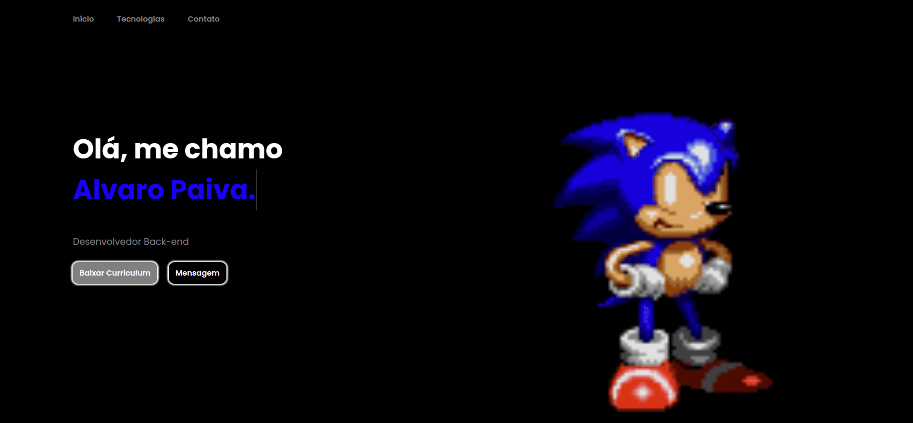

<h1 align="center">
  💻 Alvaro | Back-end Developer</h1>

<h4 align="center"><a href="https://alvaro-dev.vercel.app/">Veja o projeto clicando aqui</a></h4>

## Seções

O site é composto por seis seções:

- **Home:** Breve apresentação sobre mim e disponibilizo meu curriculum para download;
- **Tecnologias:** Nessa seção eu mostro as principais tecnologias que eu conheço e uso, com um link para a pagina principal de cada tecnologia;
- **Contato:** Aqui disponibilizo meu Github, meu LinkedIn e contato diretamente pelo WhatsApp;

---

## 💼 Tecnologias utilizadas

Para o desenvolvimento deste site utilizei as seguintes tecnologias:

- HTML;
- CSS;
- JQuery;
- JavaScript;

